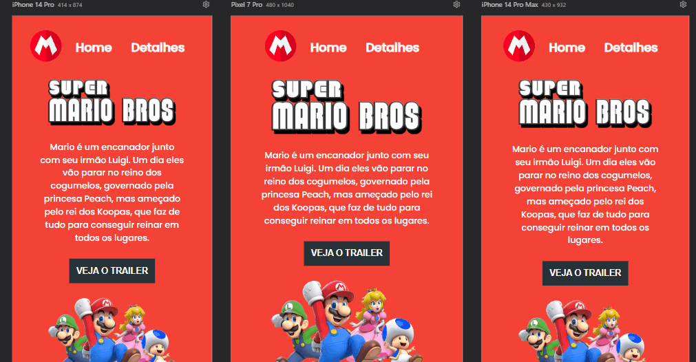

# Projeto Mario Bros.

## Descrição 📝
O projeto perfeito para testar conhecimento em CSS e JavaScript. Criando uma page que hospeda um vídeo externo, o trailer do filme do Mario Bros, o videos acessado pertence ao YouTube e deve ser reproduzido na própria page, para isso utiliza-se códigos de CSS avançado e cria a interação utilizando a lógica de programação do JavaScript. 

A ideia do projeto é como se fosse uma page de divulgação do filme.

Os usuários devem ser capazes de:

- Ver o layout ideal do site dependendo do tamanho da tela do dispositivo.

- Visualizar um site interativo, onde quando clicado no botão TRAILER, a page abra um video do YouTube.

💻- Imagem do projeto em desktop.

[]

📱- Visualização projeto em mobile.

[
]

💻- Visualização final interativa no desktop.

[
]

## Meus desafios no processo. 🤯
A realização do projeto foi tranquila, mas como estou aprenderndo, foi um pouco trabalhoso no JS, mas é incrível, ver O projeto tomando forma me deixou ansioso, estou contente com o resultado, ficou como o layout pedia.

Alguns conceito de JavaScript são um pouco complexos, mas divertido, cria estruturas incríveis, trazendo um design bonito, e dinâmico e mantendo o código limpo e bem estrutudado, estou estudando constantemente para domina-lo.     

Ansioso e animado começar a trabaljahar na área, seguindo estes estilos, e criar sites criativos e de qualidade, ultrapassando a expectativa dos meus clientes. 

Grato!😊

## Como Utilizar. 👨‍💻

Clone com o projeto:
```
git clone https://github.com/HenryRomao/PROJ.MARIO-BROS.git
```

Acesse a pasta do projeto:
```
cd PROJ.MARIO-BROS
```

Bom estudo. 🍀

## Tecnologias utilizadas. 
- HTML
- CSS
- JavaScript